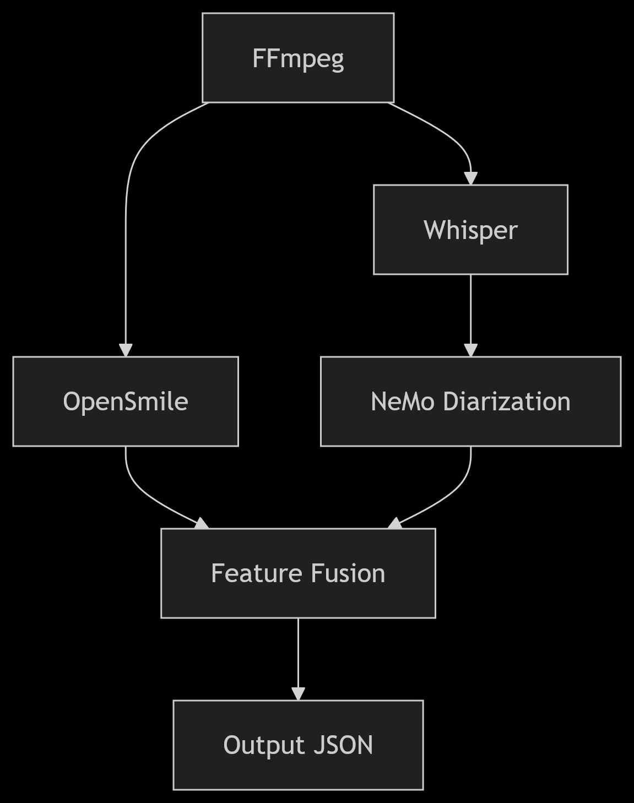

# Emotion Dubbing Pipeline

A comprehensive Docker-based pipeline for automated audio transcription, speaker diarization, and emotion analysis. This system is designed for high-quality voice dubbing with emotion preservation across languages.

## Project Overview

### Key Features
- Audio extraction from video files
- Multi-language speech transcription using Whisper
- Speaker diarization with NeMo
- Emotion and prosody analysis
- Batch processing capabilities
- GPU acceleration support
- Persistent model caching
- Distributed processing ready

### Component Overview
1. **FFmpeg Service**: Audio extraction and preprocessing
   - Handles video → audio conversion
   - Optimizes audio format for ML models
   - Supports various input formats

2. **Whisper Service**: Speech transcription
   - Uses OpenAI's Whisper large-v3 model
   - Multiple language support
   - High accuracy transcription
   - GPU-accelerated processing

3. **NeMo Diarization Service**: Speaker separation
   - Speaker identification and separation
   - Uses ECAPA-TDNN model
   - Handles multiple speakers
   - Temporal segmentation

4. **Emotion Features Service**: Emotion analysis
   - Wav2Vec2 emotion embeddings
   - OpenSMILE acoustic feature extraction
   - Prosody analysis
   - Combined feature vectors

5. **Model Hub Service**: Model management
   - Centralized model downloading
   - Version control for models
   - Cache management
   - Model verification

## Prerequisites

- Docker Engine 24.0.0 or later
- Docker Compose V2
- NVIDIA GPU (optional but recommended)
- NVIDIA Container Toolkit (if using GPU)

## Detailed Setup Instructions

### 1. Docker Setup

#### For GPU Support (Recommended):
1. Install NVIDIA drivers for your GPU
2. Install NVIDIA Container Toolkit:
```bash
# For Ubuntu/Debian
curl -fsSL https://nvidia.github.io/libnvidia-container/gpgkey | sudo gpg --dearmor -o /usr/share/keyrings/nvidia-container-toolkit-keyring.gpg
curl -s -L https://nvidia.github.io/libnvidia-container/stable/deb/nvidia-container-toolkit.list | \
  sed 's#deb https://#deb [signed-by=/usr/share/keyrings/nvidia-container-toolkit-keyring.gpg] https://#g' | \
  sudo tee /etc/apt/sources.list.d/nvidia-container-toolkit.list
sudo apt-get update
sudo apt-get install -y nvidia-container-toolkit
sudo nvidia-ctk runtime configure --runtime=docker
sudo systemctl restart docker
```

#### Verify Docker Installation:
```bash
# Check Docker version
docker --version
docker compose version

# If using GPU, verify NVIDIA Docker
docker run --rm --gpus all nvidia/cuda:12.2.0-base-ubuntu22.04 nvidia-smi
```

### 2. Project Setup

1. Clone the project:
```bash
git clone https://github.com/yourusername/emotion-dubbing.git
cd emotion-dubbing
```

2. Build Docker images:
```bash
# Build all services
docker compose build

# Or build specific services
docker compose build whisper nemo-diarize emotion-features
```

3. Download and verify models:
```bash
# First, ensure config files exist
mkdir -p config
cp docker/model-hub/default_config/* config/  # If using default configs

# Download models (this may take some time)
docker compose run --rm model-hub

# Verify models were downloaded correctly
docker compose run --rm model-hub python /app/scripts/model_manager.py --verify-only

# If you encounter any issues, you can clean the model cache and try again:
docker compose down
docker volume rm emotion-dubbing_model_cache
docker compose run --rm model-hub
```

Note: The first run may take 15-30 minutes to download all models. Models are cached in Docker volumes and won't need to be re-downloaded unless you clean the cache.

### 3. Running the Pipeline

#### Single File Processing
1. Place your input video in the input folder:
```bash
mkdir -p input
cp your_video.mp4 input/test.mp4
```

2. Run the complete pipeline:
```bash
python3 scripts/run_pipeline.py
```

#### Batch Processing
For processing multiple files:

1. Organize your input files:
```bash
mkdir -p input_batch
cp /path/to/your/videos/*.mp4 input_batch/
```

2. Run batch processing:
```bash
# Process all MP4 files in input_batch directory
python3 scripts/batch_process.py "input_batch/*.mp4" --max-concurrent 2

# Specify custom output directory
python3 scripts/batch_process.py "input_batch/*.mp4" --output-dir /path/to/outputs --max-concurrent 2
```

The batch processor will:
- Process multiple files concurrently
- Create separate output directories for each file
- Generate a summary report
- Handle failures gracefully

Example batch summary:
```json
{
  "total_files": 10,
  "completed": 9,
  "failed": 1,
  "results": [
    {
      "job_id": "video1_20250520_123456",
      "input_file": "input_batch/video1.mp4",
      "output_dir": "output/video1_20250520_123456",
      "status": "completed",
      "timestamp": "2025-05-20T12:34:56"
    },
    ...
  ]
}
```

### 4. Using Individual Components

You can also run individual components of the pipeline:

1. Extract audio: this works
```bash
docker compose run --rm ffmpeg -i /input/test.mp4 -vn -acodec pcm_s16le -ar 16000 /output/audio.wav
```

2. Run transcription:
```bash
# Basic transcription
docker compose run --rm whisper /output/audio.wav

# With additional options this works
docker compose run --rm whisper --model large-v3 --language ja --output_format json /output/audio.wav

# The output will be saved to:
# - JSON format: output/transcription.json
# - Text format: output/transcription.txt
```

3. Run speaker diarization:
```bash
docker compose run --rm nemo-diarize python /app/diarize.py /output/audio.wav /output/diarization.json
```

4. Run emotion analysis:
```bash
docker compose run --rm emotion-features python /app/scripts/analyze_prosody.py
```

## Cloud GPU Setup

The pipeline can be run on cloud GPU instances:

### AWS EC2
1. Launch a GPU instance (e.g., g4dn.xlarge)
2. Install Docker and NVIDIA drivers:
```bash
# Install Docker
sudo amazon-linux-extras install docker
sudo systemctl start docker
sudo usermod -a -G docker ec2-user

# Install NVIDIA drivers
sudo yum install -y gcc kernel-devel-$(uname -r)
sudo rpm -Uvh https://dl.fedoraproject.org/pub/epel/epel-release-latest-7.noarch.rpm
sudo yum install -y kmod-nvidia.x86_64 nvidia-x11-drv.x86_64
sudo reboot
```

### Google Cloud
1. Create a GPU instance with Ubuntu
2. Install Docker and NVIDIA drivers:
```bash
# Install Docker
curl -fsSL https://get.docker.com -o get-docker.sh
sudo sh get-docker.sh

# Install NVIDIA drivers
curl -fsSL https://nvidia.github.io/nvidia-docker/gpgkey | sudo gpg --dearmor -o /usr/share/keyrings/nvidia-docker-keyring.gpg
curl -fsSL https://nvidia.github.io/nvidia-docker/ubuntu20.04/nvidia-docker.list | sudo tee /etc/apt/sources.list.d/nvidia-docker.list
sudo apt-get update && sudo apt-get install -y nvidia-container-toolkit
sudo systemctl restart docker
```

### Azure
1. Deploy an NC-series VM
2. Follow the Ubuntu instructions above for Docker and NVIDIA setup

## Resource Requirements

Minimum requirements:
- CPU: 4 cores
- RAM: 16GB
- Storage: 20GB
- GPU: NVIDIA GPU with 8GB VRAM (for optimal performance)

Recommended:
- CPU: 8+ cores
- RAM: 32GB
- Storage: 50GB
- GPU: NVIDIA GPU with 16GB+ VRAM

## Output

The pipeline generates various outputs in the `output` directory:
- Transcription (JSON)
- Speaker diarization
- Emotion features
- Prosody analysis

## Project Structure

```
emotion-dubbing/
├── config/                    # Configuration files
│   ├── models.yaml           # Model specifications and sources
│   └── pipeline.yaml         # Pipeline parameters and settings
├── docker/                   # Docker service definitions
│   ├── emotion-features/     # Emotion analysis service
│   ├── model-hub/           # Model management service
│   ├── nemo-diarize/        # Speaker diarization service
│   └── whisper-jp/          # Speech transcription service
├── scripts/                  # Pipeline management scripts
│   ├── batch_process.py     # Multi-file processing
│   ├── run_pipeline.py      # Main pipeline executor
│   ├── utils.py             # Shared utilities
│   └── verify_setup.py      # Environment verification
├── input/                    # Input video files
└── output/                   # Generated outputs
```

## Configuration

### Model Configuration (config/models.yaml)
Controls model selection and downloading:
```yaml
models:
  whisper:
    name: "large-v3"          # Model version
    source: "openai/whisper"  # Model source
    type: "whisper"           # Model type
  diarization:
    name: "ecapa_tdnn"
    source: "nvidia/nemo"
    type: "nemo"
  emotion:
    name: "wav2vec2-large-robust-12-ft-emotion-msp-dim"
    source: "audeering/wav2vec2"
    type: "transformers"

model_path: "/models"         # Model storage location
download_missing: true        # Auto-download missing models
verify_downloads: true        # Verify model integrity
```

### Pipeline Configuration (config/pipeline.yaml)
Controls processing parameters for each stage:
```yaml
pipeline:
  audio_extraction:
    sample_rate: 16000        # Audio sampling rate
    format: wav               # Output format
    channels: 1               # Mono audio

  transcription:
    model: large-v3          # Whisper model version
    language: ja             # Target language
    batch_size: 16           # Processing batch size
    compute_type: float16    # Precision level

  diarization:
    min_speakers: 1          # Minimum speakers to detect
    max_speakers: 2          # Maximum speakers to detect
    speech_threshold: 0.3    # Speech detection threshold
    clustering_threshold: 0.7 # Speaker separation threshold

  emotion_analysis:
    window_size: 0.5         # Analysis window (seconds)
    overlap: 0.25           # Window overlap ratio
    features:               # Feature extractors to use
      - wav2vec2
      - prosody

  output:
    format: json            # Output format
    alignment:
      max_gap: 0.5         # Maximum gap between segments
      min_duration: 0.1    # Minimum segment duration
```

### Docker Service Configuration
Each service is defined in its own Dockerfile with specific requirements:

#### 1. FFmpeg Service
- Base image: jrottenberg/ffmpeg
- Purpose: Audio extraction and format conversion
- Volume mounts:
  - Input videos
  - Output audio files

#### 2. Whisper Service (docker/whisper-jp/)
- Base image: nvidia/cuda:12.2.0-base-ubuntu22.04
- GPU support: Enabled
- Features:
  - Pre-downloaded large-v3 model
  - CUDA optimization
  - Model caching

#### 3. NeMo Diarization (docker/nemo-diarize/)
- Base image: nvcr.io/nvidia/nemo:23.10
- GPU support: Enabled
- Features:
  - ECAPA-TDNN model integration
  - Speaker identification
  - Temporal segmentation

#### 4. Emotion Features (docker/emotion-features/)
- Base image: python:3.9-slim
- Key components:
  - OpenSMILE for acoustic features
  - Wav2Vec2 for emotion embeddings
  - Custom prosody analysis
  - Feature fusion pipeline

#### 5. Model Hub (docker/model-hub/)
- Base image: python:3.9-slim
- Responsibilities:
  - Model downloading
  - Cache management
  - Version control
  - Model verification

## Pipeline Operation

### Processing Flow
1. **Video Input**
   - Place video files in `input/` directory
   - Supported formats: MP4, AVI, MKV, etc.
   
2. **Audio Extraction**
   - FFmpeg extracts audio track
   - Converts to 16kHz mono WAV
   - Optimizes for ML processing

3. **Speech Transcription**
   - Whisper processes audio
   - Generates timestamped transcriptions
   - Multiple language support

4. **Speaker Diarization**
   - Identifies distinct speakers
   - Creates speaker segments
   - Temporal boundaries

5. **Emotion Analysis**
   - Extracts acoustic features
   - Computes emotion embeddings
   - Analyzes prosody patterns
   - Combines feature vectors

6. **Output Generation**
   - JSON format output
   - Aligned transcriptions
   - Speaker information
   - Emotion features
   - Prosody analysis

### Output Structure
```json
{
  "segments": [
    {
      "start": 0.0,
      "end": 2.5,
      "speaker_id": "SPEAKER_0",
      "text": "こんにちは",
      "emotion_vector": [...],
      "prosody": {
        "pitch": [...],
        "energy": [...],
        "tempo": 1.2
      }
    }
  ],
  "metadata": {
    "speakers": 2,
    "language": "ja",
    "duration": 120.5
  }
}
```

## Troubleshooting

### Common Issues

1. **GPU Issues**:
```bash
# Check NVIDIA setup
nvidia-smi
docker run --rm --gpus all nvidia/cuda:12.2.0-base nvidia-smi

# If GPU not detected:
nvidia-ctk runtime configure --runtime=docker
sudo systemctl restart docker
```

2. **Model Download Issues**:
```bash
# Clear cache and retry
docker compose down
docker volume rm emotion-dubbing_model_cache
docker compose run --rm model-hub

# Verify model integrity
docker compose run --rm model-hub python /app/scripts/model_manager.py --verify-only
```

3. **Pipeline Failures**:
```bash
# Check logs
tail -f output/pipeline.log

# Run verification
python scripts/verify_setup.py

# Test individual components
docker compose run --rm ffmpeg -i /input/test.mp4 -vn /output/audio.wav
docker compose run --rm whisper --model large-v3 /output/audio.wav
```

### Performance Optimization
1. **GPU Memory Usage**:
   - Adjust batch sizes in pipeline.yaml
   - Monitor GPU memory with nvidia-smi
   - Use float16 precision when possible

2. **Processing Speed**:
   - Enable parallel processing
   - Optimize window sizes
   - Use batch processing for multiple files

3. **Model Caching**:
   - Use persistent volumes
   - Pre-download models
   - Verify model integrity

### Using the NeMo Speaker Diarization Service

The NeMo Diarization service identifies and separates different speakers in audio recordings. Here's how to use it:

#### Prerequisites
- Audio file in WAV format (16kHz, mono)
- Docker with NVIDIA GPU support configured
- NeMo container built (`docker compose build nemo-diarize`)

#### Basic Usage
```bash
# Simple usage
docker compose run --rm nemo-diarize python /app/diarize.py /output/audio.wav /output/diarization.json

# With GPU support (using compose v2 deployment)
docker compose run --rm \
  --runtime=nvidia \
  nemo-diarize python /app/diarize.py /output/audio.wav /output/diarization.json
```
